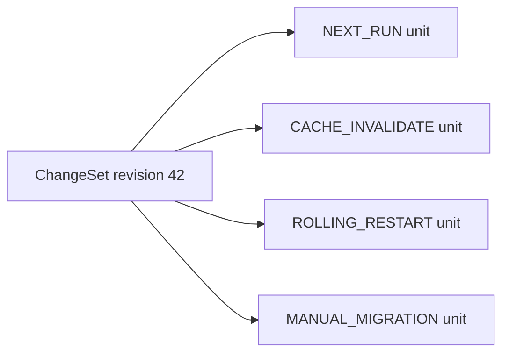
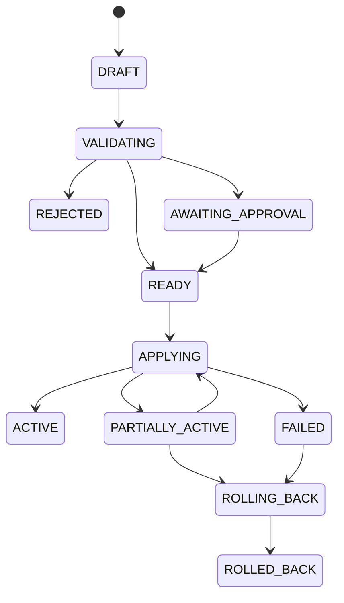

# DeerFlow 配置中台发布通道

本文是在[配置文件与热加载边界](configuration-reload-matrix.zh-CN.md)基础上形成的
配置中台发布分类。目标不是远程编辑 YAML，而是让每一项配置都有明确的下发范围、
生效动作、验证方式和回滚路径。

`config.yaml` 的逐字段类型、默认值和通道归属见
[DeerFlow config.yaml 完整字段参考](config-yaml-reference.zh-CN.md)。
配置项是否允许日常编辑、是否需要审批以及一期准入范围见
[配置中台准入与分级清单](config-center-manageability.zh-CN.md)。

## 1. 核心原则

### 1.1 下发与生效分离

所有进入中台的配置都先形成期望状态（Desired State）。下发成功只表示新 revision
已经持久化并可供实例读取，不表示它已经在所有实例生效。

中台必须分别记录：

- `desired_revision`：用户批准并下发的版本；
- `observed_revision`：某个实例已经读取的版本；
- `active_revision`：某个实例当前真正使用的版本；
- `apply_channel`：使配置生效所需的发布通道；
- `target_service`：Gateway、Frontend、Nginx 或 Provisioner；
- `active_runs_affected`：固定为 `false`，除非未来明确实现 run 内动态更新。

### 1.2 按字段路径分类，不按文件分类

同一个 `config.yaml` 同时包含热加载字段和启动字段，因此发布分类的最小单位是字段路径。

例如：

```text
models[deepseek].max_tokens          -> NEXT_RUN
llm_call.max_concurrent_calls       -> ROLLING_RESTART
database.backend                    -> MANUAL_MIGRATION
```

中台保存和分发完整配置快照，但根据新旧快照的字段 diff 生成 ReleaseUnit。

### 1.3 一个 ChangeSet 可以拆成多个 ReleaseUnit



默认执行顺序：

1. 阻止存在未批准 `MANUAL_MIGRATION` 的 ChangeSet 自动发布；
2. 发布 `ROLLING_RESTART` 单元并等待目标实例健康；
3. 发布 `CACHE_INVALIDATE` 单元并等待所有实例 ACK；
4. 发布 `NEXT_RUN` 单元；
5. 标记 ChangeSet 为 Active。

需要跨通道原子性的配置必须显式声明依赖，不能依赖 YAML 中字段的排列顺序。

## 2. 通道一：`NEXT_RUN`

### 2.1 适用语义

配置写入后无需重启进程，也不需要显式刷新进程缓存。Gateway 在下一次请求、消息或
Agent run 读取新版本。已经开始的 run 保留旧快照。

### 2.2 可发布配置

#### 模型与推理

| 字段路径 | 说明 |
| --- | --- |
| `models` | 模型列表、默认顺序、provider 参数、thinking/vision 能力、价格等 |
| `token_usage` | Token 使用统计开关和行为 |
| `token_budget` | 单次 run Token 预算 |
| `max_recursion_limit` | 客户端 recursion limit 的服务端上限 |
| `circuit_breaker` | 新建 LLM middleware 使用的熔断参数 |
| `llm_call.retry_max_attempts` | LLM 重试次数 |
| `llm_call.retry_base_delay_ms` | 普通重试基础延迟 |
| `llm_call.retry_cap_delay_ms` | 重试延迟上限 |
| `llm_call.burst_retry_base_delay_ms` | burst-rate 重试基础延迟 |

#### Agent、Prompt 与上下文

| 字段路径 | 说明 |
| --- | --- |
| `title` | 自动标题生成 |
| `summarization` | 上下文总结与保留策略 |
| `subagents` | 子 Agent 开关、模型、工具、并发/总量限制等 |
| `acp_agents` | ACP Agent 定义 |
| `agents_api` | 自定义 Agent API 行为 |
| `suggestions` | 后续问题建议 |
| `input_polish` | 输入润色 |

#### 工具与运行保护

| 字段路径 | 说明 |
| --- | --- |
| `tools` | 配置型工具定义 |
| `tool_groups` | 工具分组 |
| `tool_output` | 工具输出预算 |
| `tool_search` | 延迟工具发现与自动 promotion |
| `loop_detection` | 重复工具调用检测 |
| `tool_progress` | 工具停滞状态机 |
| `read_before_write` | 写文件前读取保护 |
| `safety_finish_reason` | Provider safety finish reason 处理 |

#### 功能、安全和业务策略

| 字段路径 | 说明 |
| --- | --- |
| `skills.deferred_discovery` | Skill metadata 是完整注入还是按需发现 |
| `skill_scan` | Skill 安全扫描策略 |
| `skill_evolution` | Skill 演进策略 |
| `guardrails` | 工具调用 Guardrail 策略 |
| `authorization` | 资源授权策略 |
| `knowledge_base` | LightRAG 地址、超时、检索和 ingestion 参数；密钥必须用 SecretRef |
| `uploads` | 上传和文档转换策略 |
| `auth.local` | 本地注册策略 |
| `auth.oidc` | OIDC provider 和用户准入策略；密钥必须用 SecretRef |

#### Memory 的热加载子集

| 字段路径 | 说明 |
| --- | --- |
| `memory.enabled` | Memory 总开关 |
| `memory.mode` | middleware/tool 模式 |
| `memory.injection_enabled` | Prompt 注入开关 |
| `memory.shutdown_flush_timeout_seconds` | Gateway 关闭时读取；同时校验 K8s termination grace period |

### 2.3 发布动作

1. 对候选快照执行 YAML/JSON Schema 与 Pydantic 校验；
2. 校验模型、工具、provider class path 和所有 SecretRef；
3. 原子写入 revision；
4. 发布 `config.revision.available` 事件；
5. Gateway 在下一次配置访问时读取新 revision；
6. 实例上报 `observed_revision`。

### 2.4 成功条件

- 期望快照已持久化；
- 至少一个健康 Gateway 已成功解析该 revision；
- 所有 Gateway 最终上报相同 `observed_revision`；
- 新建 canary run 的配置指纹等于目标 revision；
- 旧 active run 不被中断。

如果实例解析失败，应继续服务最后一个可用版本，并上报 `ConfigRejected`，不能把错误配置
静默标记为 Active。

## 3. 通道二：`CACHE_INVALIDATE`

### 3.1 适用语义

配置或制品已经在线下发，但运行进程可能持有 catalog、prompt section、MCP session 或
工具缓存。中台必须通知所有目标实例刷新，并收集逐实例 ACK。

这个通道名称包含“刷新运行时视图”的含义；某些资源本身没有长期缓存，但仍通过该通道
完成多实例版本收敛。

### 3.2 可发布配置和制品

| 资源 | 字段/文件 | 刷新动作 |
| --- | --- | --- |
| MCP 配置 | `extensions_config.json -> mcpServers` | 重置 MCP tools cache 和 session pool；下一次 run 重建工具 |
| MCP interceptor | `mcpInterceptors` | 重建 MCP 工具和 interceptor |
| Skill 启用状态 | `skills.<name>.enabled` | 失效 Skill catalog 和 prompt section |
| Extension middleware | `middlewares` 或 `config.yaml -> extensions.middlewares` | 新 run 重建 Agent graph；同时刷新合并后的 extensions revision |
| Skill 包 | `SKILL.md`、脚本、references、assets | 安装/校验制品，然后调用 Skill reload |
| 自定义 Agent | `config.yaml`、`SOUL.md` 或数据库 Agent definition | 更新定义 revision；下一次 run 重新读取 |

### 3.3 发布动作

1. 校验制品完整性、名称唯一性、SkillScan 和 class path；
2. 原子发布配置或制品 revision；
3. 广播带 revision 的失效事件；
4. 每个 Gateway 执行对应刷新动作；
5. 等待全部目标实例 ACK；
6. 发起新 run 验证 MCP/Skill/Agent catalog 指纹；
7. 达到策略要求后标记 Active。

现有 DeerFlow 接口可以作为第一版执行器：

- MCP：`PUT /api/mcp/config`，必要时调用 MCP cache reset；
- Skill 状态：Skill update API；
- Skill 外部文件变更：`POST /api/skills/reload`；
- 自定义 Agent：`/api/agents`；
- 多 worker/多 Pod：必须逐实例执行或由实例订阅广播事件，不能只调用 Service 地址一次。

### 3.4 成功条件

- 所有目标实例返回相同 revision 的 ACK；
- MCP 服务器/工具 catalog 指纹一致；
- Skill catalog、enabled 状态和 package digest 一致；
- Agent definition revision 一致；
- 新 run 使用新配置，旧 run 不变。

实例没有在超时时间内 ACK 时，发布状态应为 `PARTIALLY_ACTIVE`，不能显示为成功。

## 4. 通道三：`ROLLING_RESTART`

### 4.1 适用语义

配置已下发到部署环境，但必须重建进程级单例、中间件、连接池或后台任务。中台应调用
部署控制器滚动重启目标服务，而不是只写文件。

### 4.2 Gateway 标准重启配置

| 字段路径 | 重启原因 | 默认风险 |
| --- | --- | --- |
| `log_level` | 日志级别启动时应用 | 低 |
| `logging` | formatter、trace filter、TraceMiddleware 启动时安装 | 中 |
| `channels` | IM 客户端在 lifespan 创建 | 中 |
| `channel_connections` | repository、worker 和 provider 配置启动时绑定 | 中 |
| `scheduler` | poller 和并发限制启动时创建 | 中 |
| `run_ownership` | lease heartbeat 任务启动时创建 | 高 |
| `llm_call.max_concurrent_calls` | 进程级跨 loop limiter 首次使用后冻结 | 中 |
| `memory.manager_class` | MemoryManager 是进程单例 | 高 |
| `memory.backend_config` | Memory backend 实例启动时解析 | 高；涉及存储位置时转人工迁移 |
| `skills.use` | SkillStorage 实现类型变化 | 高 |
| `skills.path` | Skill 宿主路径和共享存储位置变化 | 高 |
| `skills.container_path` | Sandbox 内 Skill 挂载路径变化 | 高 |

`channels.<provider>` 也可以走定向 Channel restart，但配置中台第一期建议统一走 Gateway
滚动重启，避免“文件已更新、部分 Channel 已刷新”的双重状态模型。

### 4.3 Gateway 基础设施配置

这些字段仍由 `ROLLING_RESTART` 通道编排，但默认要求审批和额外 preflight：

| 字段路径 | 必须执行的检查 |
| --- | --- |
| `database` | 连接性、schema migration、连接池参数、备份、所有实例一致性 |
| `checkpointer` | backend 可用性、与现有 checkpoint 兼容性 |
| `run_events` | event store 可用性、历史查询和保留策略 |
| `agent_storage` | 文件/数据库 repository 可用性和定义迁移状态 |
| `stream_bridge` | Redis/内存 bridge 可用性、跨 worker 拓扑和 optional extra |
| `sandbox` | provider 依赖、镜像、Provisioner、挂载和网络连通性 |

`skills.use/path/container_path` 虽然不在当前 `STARTUP_ONLY_FIELDS` 注册表中，但配置中台
按更保守的部署边界处理：它们会改变存储实现或宿主机/Sandbox 挂载拓扑，必须刷新实例并
验证新旧路径、共享卷和 Sandbox 可见性，不能作为普通 Agent 行为配置在线切换。

其中发生以下变化时，不得自动执行，必须转入 `MANUAL_MIGRATION`：

- `database.backend` 或数据库目标切换；
- `database.checkpoint_channel_mode` 切换；
- `checkpointer` backend 切换且已有 checkpoint；
- `agent_storage.backend` 切换且已有自定义 Agent；
- `memory.manager_class` 或存储路径切换且已有 Memory 数据；
- 任何需要数据复制、格式迁移或不可逆 schema 变化的配置。

### 4.4 环境变量和 SecretRef

以下配置由进程环境提供，更新后至少重启对应服务：

| 类别 | 目标服务 |
| --- | --- |
| 模型、Search、MCP、Channel provider secret | Gateway |
| `DATABASE_URL`、Redis URL、内部认证 token | Gateway |
| `GATEWAY_*`、`DEER_FLOW_*` 路径和拓扑变量 | Gateway 或相关服务 |
| LangSmith、Langfuse、Monocle | Gateway |
| Provisioner/Kubernetes 参数 | Provisioner；引用它们的 Gateway 配置同时更新时也滚动 Gateway |
| Frontend server-only 环境变量 | Frontend |

中台配置只保存 SecretRef，不保存明文 secret。Secret 更新后由部署控制器重新注入环境并
滚动目标 workload。

### 4.5 发布动作

1. 验证完整配置和 SecretRef；
2. 执行依赖连通性、迁移状态和容量 preflight；
3. 写入 Desired State；
4. 为 Pod/容器注入 `CONFIG_REVISION`；
5. 按 `maxUnavailable` / `maxSurge` 滚动实例；
6. 每个新实例完成启动、readiness 和配置指纹上报；
7. 验证 run 创建、流式连接以及后台服务；
8. 所有目标实例 Active 后结束发布。

### 4.6 成功条件

- 所有旧实例已退出或不再接流量；
- 所有健康实例的 `active_revision` 相同；
- Gateway readiness、数据库、StreamBridge、Sandbox 和必要 Channel 检查通过；
- 滚动期间已有 run 的处理符合既定 drain/cancel/recovery 策略；
- 失败时可以恢复上一 revision，而不是仅回滚配置文件。

## 5. 不进入三个自动通道的配置

### 5.1 `MANUAL_MIGRATION`

这不是第四个自动发布通道，而是阻塞状态。它要求迁移方案、备份证据、审批和独立回滚
步骤。完成迁移后，再由 `ROLLING_RESTART` 激活目标配置。

### 5.2 `REBUILD`

以下配置进入构建/部署系统，不进入运行时配置中台：

- `NEXT_PUBLIC_*`；
- `frontend/next.config.js`；
- Dockerfile；
- `pyproject.toml`、`uv.lock`；
- `package.json`、`pnpm-lock.yaml`；
- 编译、lint、test 和 CI 配置。

### 5.3 运行数据

以下内容不是配置，不能通过配置发布覆盖：

- `.deer-flow` 下的数据库、Memory、run event 和 checkpoint；
- 用户上传文件和 workspace；
- Thread、run、scheduled task 和 Channel connection 数据；
- OAuth token、MCP token 等运行时凭据状态。

## 6. 发布数据模型

### 6.1 ChangeSet

```json
{
  "id": "chg_20260728_0042",
  "base_revision": 41,
  "target_revision": 42,
  "status": "VALIDATED",
  "created_by": "user-id",
  "reason": "调整模型预算并启用新 MCP 服务",
  "release_units": [
    "unit_next_run_42",
    "unit_cache_invalidate_42"
  ]
}
```

### 6.2 ReleaseUnit

```json
{
  "id": "unit_next_run_42",
  "change_set_id": "chg_20260728_0042",
  "apply_channel": "NEXT_RUN",
  "target_service": "gateway",
  "field_paths": [
    "models[deepseek].max_tokens",
    "token_budget.max_input_tokens"
  ],
  "desired_revision": 42,
  "risk": "medium",
  "approval_required": false,
  "active_runs_affected": false
}
```

### 6.3 InstanceObservation

```json
{
  "instance_id": "gateway-7d8c9f-abc12",
  "service": "gateway",
  "desired_revision": 42,
  "observed_revision": 42,
  "active_revision": 42,
  "status": "ACTIVE",
  "config_digest": "sha256:...",
  "observed_at": "2026-07-28T12:00:00Z"
}
```

## 7. 发布状态机



`ACTIVE` 必须由实例观测和验证产生，不能在写入配置文件后直接设置。

## 8. 第一阶段建议范围

第一阶段只实现低风险闭环：

1. `NEXT_RUN`：模型、Token、Agent 行为、工具策略、Knowledge 非密钥配置；
2. `CACHE_INVALIDATE`：MCP、Skill enabled、Skill 包、自定义 Agent；
3. `ROLLING_RESTART`：日志、Scheduler、Channel、`llm_call.max_concurrent_calls`；
4. 环境变量只支持 SecretRef 和 Gateway/Frontend 滚动重启；
5. `database`、`checkpointer`、`agent_storage`、Memory 存储迁移只展示 diff、风险和审批，
   不自动执行。

第一阶段暂不要求把 DeerFlow 改造成主动订阅配置中心。可以先由中台维护 versioned snapshot，
通过现有 Gateway API、共享配置卷和 Kubernetes/Compose 部署控制器执行发布；同时补充实例
revision/health 上报。等三条通道的状态、审计和回滚稳定后，再引入长连接配置订阅。
